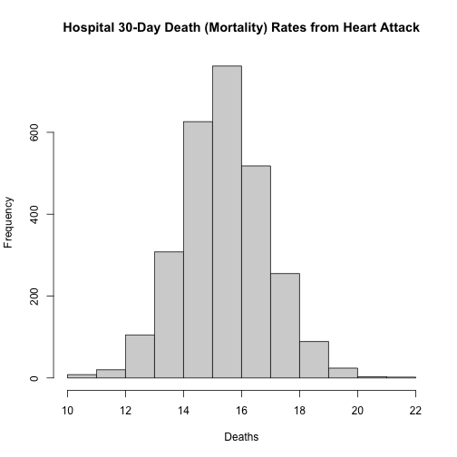

## Project 3: Hospital Quality

This is the third and final project in the R Programming module. It will involve writing 4 R-scripts. The data used in this project can be downloaded at the link [Programming Assignment 3  Data](https://d396qusza40orc.cloudfront.net/rprog%2Fdata%2FProgAssignment3-data.zip) [832K]. For this assignment you will need to unzip this file in your working directory.

<hr/>

### Part 1 - Plot the 30-day mortality rates for heart attack:

Plot a histogram of the 30 day mortality rates for heart attack. See code below. 


```r
# 1 Plot the 30-day mortality rates for heart attack:
outcome <- read.csv("./data/outcome-of-care-measures.csv", colClasses = "character")
outcome[, 11] <- suppressWarnings(as.numeric(outcome[, 11]))
hist(outcome[, 11],xlab= "Deaths", main = "Hospital 30-Day Death (Mortality) Rates from Heart Attack")
```



### Part 2 - Finding the best hospital in a state:

Coursera Assignment, "Write a function called best that take two arguments: the 2-character abbreviated name of a state and an outcome name. The function reads the outcome-of-care-measures.csv file and returns a character vector with the name of the hospital that has the best (i.e. lowest) 30-day mortality for the specified outcome in that state. The hospital name is the name provided in the Hospital.Name variable. The outcomes can be one of “heart attack”, “heart failure”, or “pneumonia”. Hospitals that do not have data on a particular outcome should be excluded from the set of hospitals when deciding the rankings."


```r
#library(dplyr)

best<-function(state, outcome){
        data <- read.csv("./data/outcome-of-care-measures.csv", colClasses = "character",header=TRUE)
        df <- as.data.frame(cbind(data[, 2],   # hospital
                                  data[, 7],   # state
                                  data[, 11],  # heart attack
                                  data[, 17],  # heart failure
                                  data[, 23]), # pneumonia
                            stringsAsFactors = FALSE)
        colnames(df) <- c("hospital", "state", "heart attack", "heart failure", "pneumonia")
        df[,3:5] <- lapply(df[,3:5], function(x) suppressWarnings(as.numeric(x)))
        
        if(!(state %in% df[, "state"])){
                stop('invalid state')
        } else if(!(outcome %in% c("heart attack", "heart failure", "pneumonia"))){
                stop('invalid outcome')
        } else {
                interested_data <- df[which(df[, "state"] == state),]
                min_val <- min(interested_data[[outcome]], na.rm = TRUE)
                result  <- interested_data[which(interested_data[[outcome]] == min_val),][,'hospital']
                output  <- result[order(result)][1]
        }
        
        return(output)
}
```

### Part 3 - Ranking hospitals by outcome in a state:

Coursera Assignment, "Write a function called rankhospital that takes three arguments: the 2-character abbreviated name of a state (state), an outcome (outcome), and the ranking of a hospital in that state for that outcome (num). The function reads the outcome-of-care-measures.csv file and returns a character vector with the name of the hospital that has the ranking specified by the num argument"


```r
rankhospital <- function(state, outcome, rank = "best"){
        ## Read outcome data
        data <- read.csv("./data/outcome-of-care-measures.csv", colClasses = "character",header=TRUE)
        df <- as.data.frame(cbind(data[, 2],   # hospital
                                  data[, 7],   # state
                                  data[, 11],  # heart attack
                                  data[, 17],  # heart failure
                                  data[, 23]), # pneumonia
                            stringsAsFactors = FALSE)
        colnames(df) <- c("hospital", "state", "heart attack", "heart failure", "pneumonia")
        df[,3:5] <- lapply(df[,3:5], function(x) suppressWarnings(as.numeric(x)))
        
        if(!(state %in% df[, "state"])){
                stop('invalid state')
        } else if(!(outcome %in% c("heart attack", "heart failure", "pneumonia"))){
                stop('invalid outcome')
        } else if(is.numeric(rank)){
               interested_data <- df[which(df[, "state"] == state),]
               output <- interested_data[order(interested_data[[outcome]],interested_data[["hospital"]]),][,"hospital"][rank]
        } else if(!is.numeric(rank)){
                if (rank == "best") {
                        output <- best(state, outcome)
                } else if (rank == "worst"){
                        interested_data <- df[which(df[, "state"] == state),]
                        output <- interested_data[order(interested_data[[outcome]],interested_data[["hospital"]], decreasing = TRUE),][,"hospital"][1]
                } else {
                        stop('invalid rank')
                }
        }
        return(output)
}
```

### Part 3 - Ranking hospitals in all states:

Coursera Assignment, "Write a function called rankall that takes two arguments: an outcome name (outcome) and a hospital rank- ing (num). The function reads the outcome-of-care-measures.csv file and returns a 2-column data frame containing the hospital in each state that has the ranking specified in num."


```r
rankall <- function(outcome, num = "best") {
        ## Read outcome data
        data <- read.csv("./data/outcome-of-care-measures.csv", colClasses = "character",header=TRUE)
        df <- as.data.frame(cbind(data[, 2],   # hospital
                                  data[, 7],   # state
                                  data[, 11],  # heart attack
                                  data[, 17],  # heart failure
                                  data[, 23]), # pneumonia
                            stringsAsFactors = FALSE)
        colnames(df) <- c("hospital", "state", "heart attack", "heart failure", "pneumonia")
        df[,3:5] <- lapply(df[,3:5], function(x) (suppressWarnings(as.numeric(x))))
        
        if(!(outcome %in% c("heart attack", "heart failure", "pneumonia"))){
                stop('invalid outcome')
        } else if(is.numeric(num) | num=="best"){
                if (num=="best"){num <- 1}
                output <- data.frame(hospital=character(0), state=character(0))
                states <- unique(df[,2])
                for (state in states){
                        state_data <- df[which(df[, "state"] == state),]
                        hosp <- state_data[order(state_data[[outcome]],state_data[["hospital"]]),][,"hospital"][num]
                        output <- rbind(output, data.frame(hospital=hosp, state=state))
                }
        } else if(!is.numeric(num)){
                if (num == "worst") {
                        output <- data.frame(hospital=character(0), state=character(0))
                        states <- unique(df[,2])
                        for (state in states){
                                state_data <- df[which(df[, "state"] == state),]
                                hosp <- state_data[order(state_data[[outcome]],state_data[["hospital"]],decreasing = TRUE),][,"hospital"][1]
                                output <- rbind(output, data.frame(hospital=hosp, state=state))
                        }
                }
        }
        return(output[order(output[["state"]]),])
}
```
